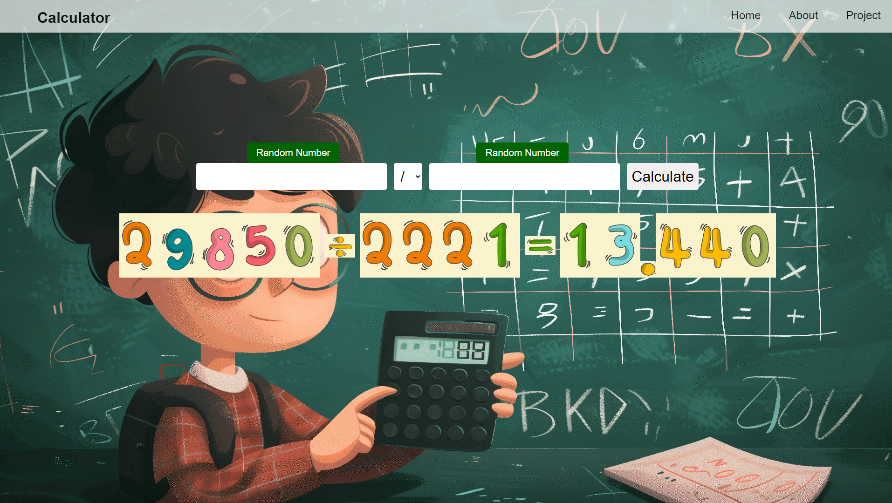

# calc-app

# About

- HTML, CSS and JavaScript project for a client.
- A calculator website where the inputs and result are turned into images when you calculate.
- You can use the four operators : plus, minus, multiply and divide.
- You can also put random values in the inputs.

<video controls src="video.mp4" title="site-preview"></video>

